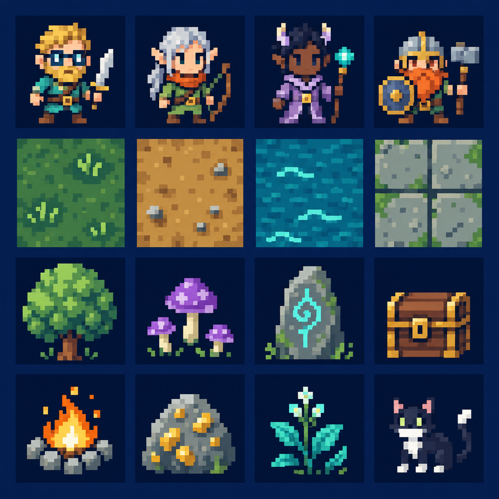

# Retrosim

A fantasy adventuring RPG in a persistent, simulated world. **Preproduction: no playable game yet.**

Explore, fight, gather, and form lasting relationships with capable companions. Discoveries and choices should change what you can do and leave observable consequences in the surrounding society.



## Current priority: try the combat before choosing it

Build a small **combat comparison lab** using a shared party, encounter, art, and interface. Test the feel, then choose the rules. Combat is deliberately **undecided**.

- [Combat options and demo requirements](docs/COMBAT_DEMOS.md)
- [UI prototype brief](docs/UI.md)
- [Confirmed decisions and open questions](docs/DECISIONS.md)
- [Milestones](docs/ROADMAP.md)
- [Development workflow](CONTRIBUTING.md)
- [Implementation with GPT-6.1 Sol agents](docs/IMPLEMENTATION_FLOW.md)
- [Asset reference and provenance](assets/reference/README.md)

## Direction

Flat square-grid world; expressive, chunky pixel art; long-term progression; meaningful mysteries; intelligent companions with persistent memories and relationships. Existing documented fiction will ground the world. The Dalelands/Cormanthor proposal is a candidate, not a confirmed setting.

Rust + Bevy is the proposed implementation stack. Keep simulation, rendering/UI, and model-provider integration separate. The game owns world facts and character memories; models propose actions that game rules validate.

## Repository checks

Requires Node.js 24 or later for the small repository check:

```sh
node tools/check-foundation.mjs
```

The GitHub Actions workflow is defined to check documentation links, demo definitions, and the approved image checksum on pushes and pull requests. The checks pass locally; GitHub execution awaits the first push. This is a foundation check, not a Rust build or gameplay test. Rust build/lint/test jobs will be added with the first Rust workspace.

This public repository was requested by its owner. Do not commit credentials, private saves, personal chat history, or private reference material.
